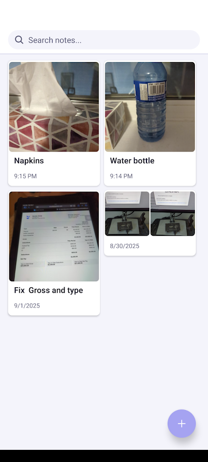

# Photo Notes



A lightweight, offline-friendly mobile app to capture photos and jot quick notes. Built with React Native and Expo, it stores data locally on-device and focuses on speed and simplicity.

## Features

- Take a picture and create a note instantly
- Attach multiple images to a note; fast grid preview and full-screen viewer
- Search notes (client-side, by text)
- Grid/List layouts with sticky FAB for quick capture
- Multi-select with contextual action bar (delete)
- Autosave while editing
- Local storage via AsyncStorage (no backend required)
- Basic share-to-app handling scaffolding + dev testing panel

## Tech stack

- React Native 0.76.x, React 18
- Expo SDK 52 (Image Picker, File System, Haptics, Linking, Status Bar)
- React Navigation (stack)
- FlashList for performant lists
- AsyncStorage for persistence
- TypeScript

## Getting started

Prerequisites:
- Node.js 18+ and npm or yarn
- Expo CLI (optional for QR workflows): `npm i -g expo-cli` (or use `npx expo`)
- Android Studio or Xcode if running native builds

Install and run (development):

```bash
# Install dependencies
npm install

# Start Metro bundler
npm run start

# In a separate terminal (optional)
# Run on Android emulator/device
npm run android

# Run on iOS simulator (macOS)
npm run ios
```

You can also use Expo Go to scan the QR code from the terminal or web UI when running `npm run start`.

### Permissions

The app requests camera access to take photos and media/library access as needed to read/write images. All data stays on-device.

## Build and release

- Quick guide for production: see `README_PRODUCTION.md`
- Detailed Android APK notes (version compatibility, Kotlin, Gradle): see `BUILD_GUIDE.md`

Using EAS (Expo Application Services):

```bash
# Production build for stores
# Requires an Expo account and configured credentials
npm i -g eas-cli

# Login once
eas login

# Build (adjust platform as needed)
eas build --profile production --platform all
```

## Project structure

```
photo-notes/
├─ App.tsx                # App root, providers, navigation
├─ app.json               # Expo app config
├─ eas.json               # EAS build profiles
├─ src/
│  ├─ components/         # UI components (ImageGrid, ImageViewer, etc.)
│  ├─ constants/          # Theme/colors
│  ├─ context/            # NotesContext (state, persistence)
│  ├─ navigation/         # React Navigation stack
│  ├─ screens/            # Home and Note editor screens
│  ├─ types/              # Shared types
│  └─ utils/              # Storage, UUID, share helpers
└─ BUILD_GUIDE.md         # Android build troubleshooting guide
```

## Usage tips

- Home: tap the + FAB to open the camera and auto-create a note with the image
- Long press a note to enter selection mode and delete
- Tap a note to edit text and manage images; images open in a full-screen viewer
- Use the search bar to filter notes by text
- The dev-only Share Testing Panel helps simulate sharing images into the app while developing

## Data & privacy

- Notes and settings are stored locally using AsyncStorage
- Shared/captured images are copied into the app’s document directory for persistence
- There is no remote backend or analytics in this repository

## Contributing

Contributions are welcome! To get started:

1. Fork the repo and create a feature branch
2. Keep changes focused and small; add brief tests or manual steps when possible
3. Run the app and verify there are no TypeScript or runtime errors
4. Open a pull request with a clear description and screenshots if UI changes

## License

This project is licensed under the MIT License. See the `LICENSE` file for details.

---

Questions or ideas? Open an issue on GitHub.